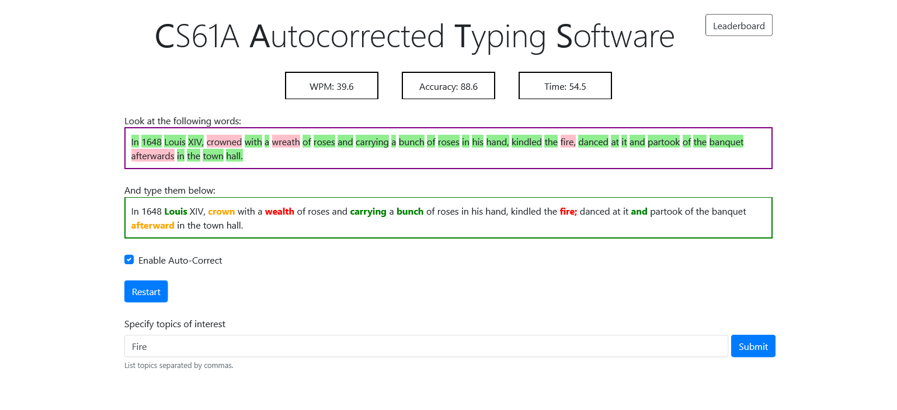

# cats
💻 Source Code for Berkeley's CS61A Cats project

The course was not taken as part of Berkeley University's curriculum but rather self-undertaken as a skill enhancement course.

## 🎮 About the game
The project is a speed test which you can go through to check your typing speed. It can also be played as a multiplayer game. Mis-typed words are auto-corrected.

## How to use
Clone the repository and run command `python3 gui.py` or `python gui.py` to view the homepage of the website.

## Screenshots
### Cats Autocorrect Feature

### Cats Basic Functioning

### Cats Autocorrect with Specified Interest

